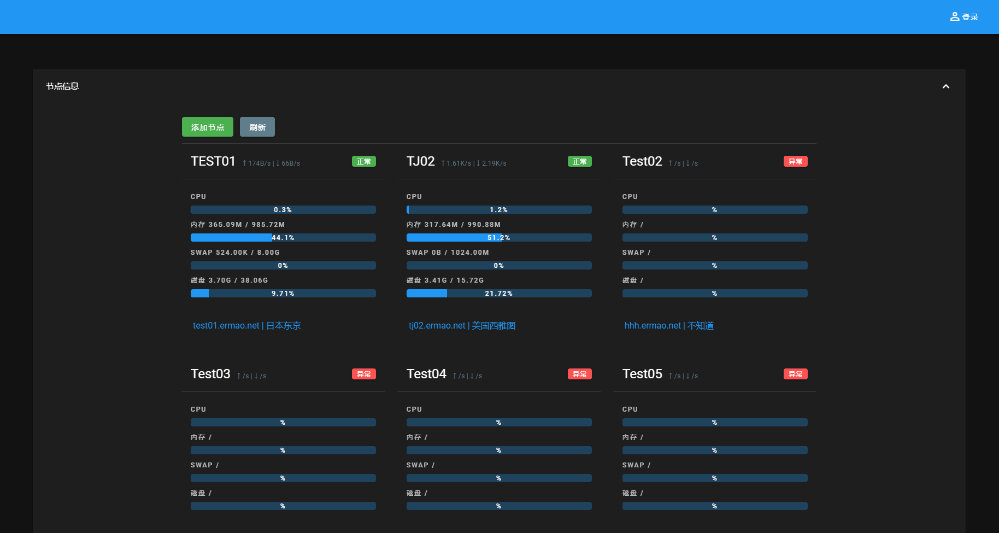
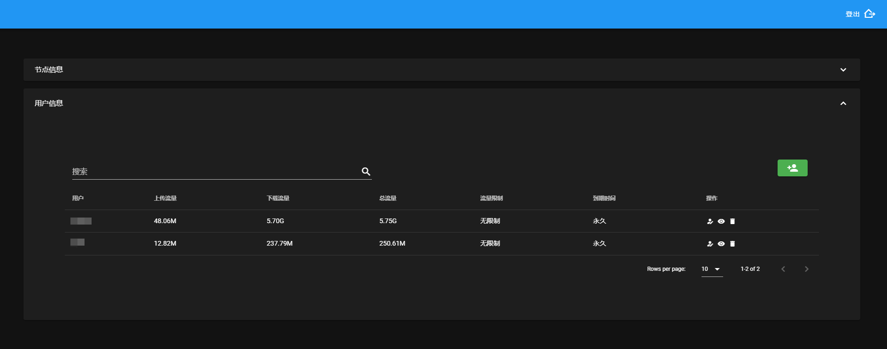
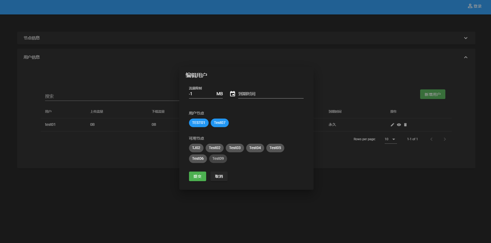
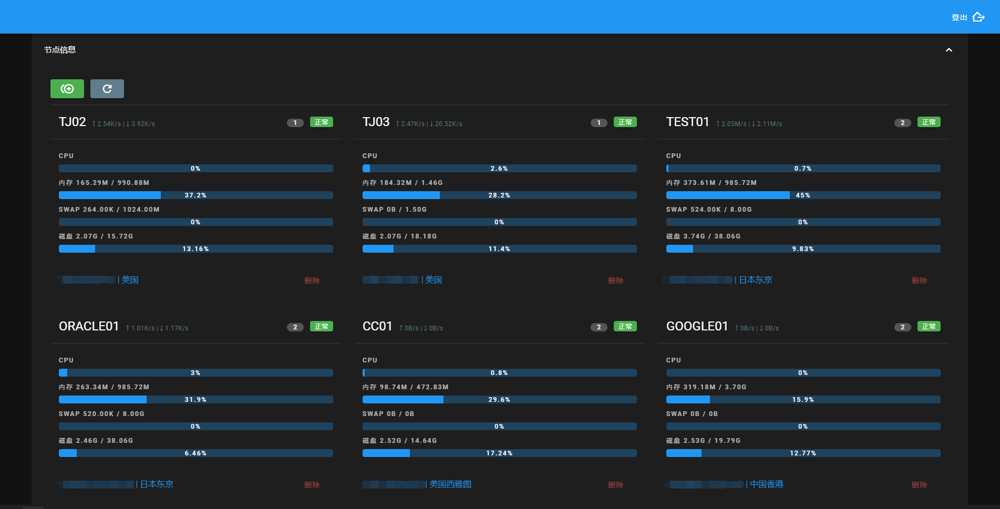

# trojan-go-panel
trojan-go 多用户多节点管理面板

## 进度😋
基础功能已经完成，有一定动手能力的小伙伴们可以部署了！
如果还要等完全体，建议下周末（2021-07-11）再来看看！

## 部署

部署之前建议先更新包仓库

`yum update||apt-get update`

### 已通过测试的系统

- CentOS 7 64 Bit

### 暂不支持的系统

- Debian

### 主节点部署

`source <(curl -sL https://git.io/install-trojan)`

### 子节点部署
`source <(curl -sL https://git.io/install-trojan) --worknode 子节点域名 主节点域名 子节点名称 主节点数据库密码`

## 展示
### 多节点状态查看

### 多用户流量查看

### 用户限制以及增删节点

### 查看链接及订阅

## 画大饼

- [x] 实装日期限制与流量限制  2021-07-05
- [ ] 主节点启用 trojan
- [ ] 子节点分组与子节点查询
- [ ] 子节点简要信息（目前节点信息占用空间太大，节点一多就很乱）
- [ ] 主节点与子节点改用 https 协议
- [ ] 监控子节点 trojan 状态
- [ ] 面板控制节点升级、重启
- [ ] 删除子节点
- [ ] 各节点可选独立部署数据库，减少主节点IO压力
- [ ] 用户权限自由配置
- [ ] 通过面板自动部署子节点
- [ ] 子节点 trojan 日志查看
- [ ] 优化面板响应速度

## 开发手册

想共同开发或是自己魔改的小伙伴可以参阅开发手册

[开发手册](https://github.com/ermaozi/trojan-go-panel/wiki/%E5%BC%80%E5%8F%91%E6%89%8B%E5%86%8C)

## 致谢

感谢所有支持、参与此项目的同学。

致谢名单

| 时间 | 称呼 | 说明 |
| ---- | ---- | ---- |
| 2021-07-03 | **我媳妇** | 媳妇看我天天肝到两点钟实在辛苦，赞助10元红包。在此答谢。|

